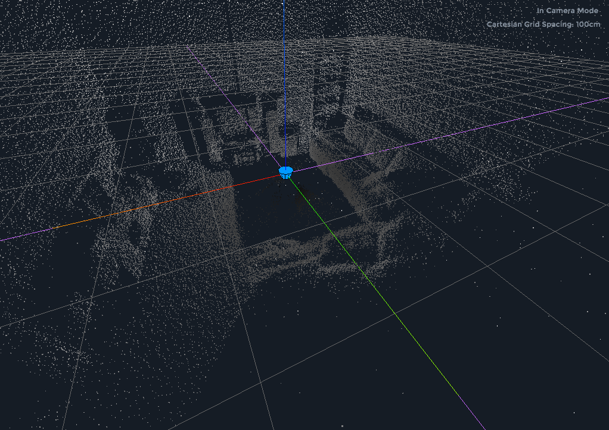

# Sweep Scans

This repository hold scans from the the [Scanse](http://scanse.io) Sweep
LIDAR with 3D scanner. The data were featured in a review of the unit for
[Servo Magazine](http://www.servomagazine.com) in the August 2017 issue.

The data are free for you to experiment with using the
[Sweep Visualizer](http://scanse.io/downloads) software or any other software
of your choice. The files are simply CSV files of scan index, x, y, z, and
signal strength.

```
SCAN_INDEX,X,Y,Z,SIGNAL_STRENGTH
0,-5,-399,436,35
0,-5,-404,481,65
0,-5,-396,516,55
0,-5,-387,551,60
0,-4,-361,566,35
1,1,103,28,84
1,1,102,26,167
```


